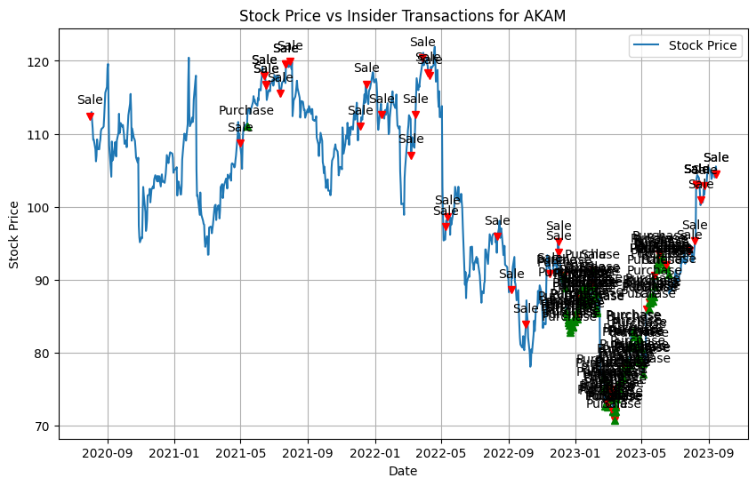
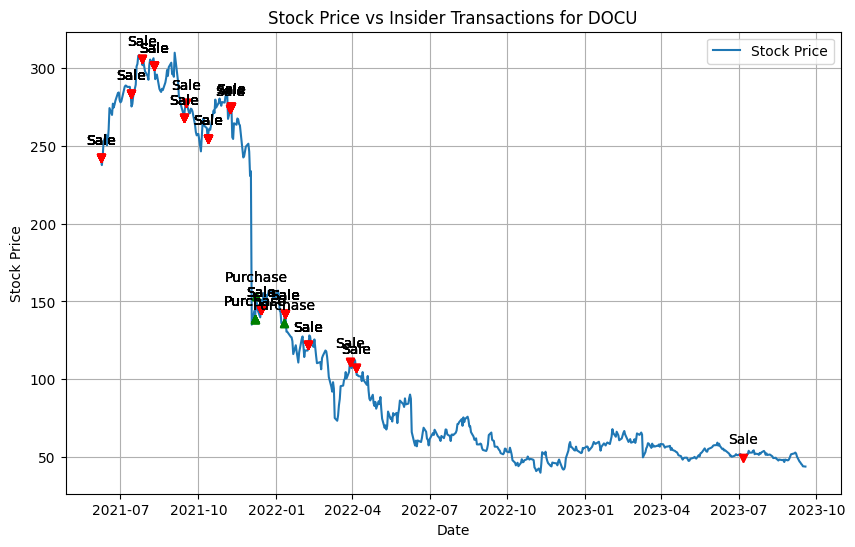

# Alternative Financial Data Analysis

 
 

This is the source code for a project that Suhas and I completed for our Big Data/Distributed Programming class in our Master of Science in IT & Management at the University of Texas at Austin.

The purpose of this project was to investigate the utility of alternative financial data in predicting US equity prices and making trading decisions. The project contains three main investigations: congress trading, patent analysis, and insider trading analysis. Please see the sections below.

> _Before running either notebook, please make sure to install the required packages in the `requirements.txt` file: `pip install -r requirements.txt`_

### Table of Contents

- [Congress Trading Analysis](#congress-trading-analysis)
- [Insider Trading Analysis](#insider-trading-analysis)
- [Patent Analysis](#patent-analysis)
- [License](#license)

## Congress Trading Analysis

> _View the Notebook:_ 🔗[**congress-trading.ipynb**](./analysis/congress-trading.ipynb)

_Analysis description and motivations ..._

### Python Packages Used

In this analysis we utilized the following Python packages:

- **PySpark, numpy, pandas:** Used for ...
- **yFinance:**  Used for ...
- **matplotlib:** Used for ...

### Data & Acquisition

...

### Results and evaluation

...

[Back to Top 🔝](#table-of-contents)

## Insider Trading Analysis

> _View the Notebook:_ 🔗[**insider-trading-analysis.ipynb**](./analysis/insider-trading-analysis.ipynb)

For this analysis we investigated the utility of insider trading data in predicting US equity prices and making trading decisions. Inside trades must be reported to the SEC within 2 business days of the trade. In theory, if a signifigant number of insiders are buying or selling a stock, it could be a signal that the stock is going to go up or down. 

We investigated this theory by looking at the historical performance of stocks that had a high number of insider buys or sells.

### Python Packages Used

In this analysis we utilized the following Python packages:

- **PySpark, numpy, pandas:** Used for data manipulation and analysis.
- **yFinance:**  Used to get historical stock prices for the window of insider trades that we were analyizing.
- **matplotlib, seaborn:** Used for data visualization.

### Data & Acquisition

The crucial part of this analysis was the data acquisition. To obtain the insider trading data, we gathered a large dataset from the [Quiver Quantitative](https://www.quiverquant.com/insiders/) API. We then needed to acquire the historical stock prices for the stocks that we were analyzing. We used the [yFinance](https://pypi.org/project/yfinance/) package to get the historical stock prices for the stocks that we were analyzing by specifying the date range of the insider trades that we were analyzing.

### Results & Evaluation

Given the method of analysis, the results of this study were largely qualitative and visual. We were looking for stocks that had a high number of insider buys or sells and then looking at the historical performance of the stock after the insider trades. We were simply looking for visual patterns in the data that would indicate that insider trades could be used as a signal for future stock performance, which could then be further investigated in a more quantitative manner. The following are a couple of notable results.

> _It is important to note that these results are be affected by the quality of our data, and some of the results may be skewed by the fact that we are looking at the data that was presently available. In a real-world scenario, we would be working with much more robust data and would be able to look at the data in real-time._

Below is our result for the analysis of Akamai Technologies (AKAM). We can see that there were a large number of insider buys in the middle of 2023, and the stock price has been on a steady rise since then.

Another notable result relates to DocuSign (DOCU). We can see that there was a signifigant number of sales in Q3-Q4 2021, and the stock price has been on a steady decline since then with sales dominating the insider activity. 

Overall, these results suggest that insider trading data could be used as a signal for future stock performance. However, it is important to note that this factor alone is not enough to make trading decisions. It is also important to consider other factors such as the company's financials, the industry, and the overall market conditions.

[Back to Top 🔝](#table-of-contents)

## Patent Analysis

> _View the Notebook:_ 🔗[**patent-analysis.ipynb**](./analysis/patent-analysis.ipynb)

_Analysis description and motivations ..._

### Python Packages Used

In this analysis we utilized the following Python packages:

- **PySpark, numpy, pandas:** Used for ...
- **yFinance:**  Used for ...
- **matplotlib, seaborn:** Used for ...

### Data & Acquisition

...

### Results & Evaluation

...

[Back to Top 🔝](#table-of-contents)

## License

For this github repository, the software license used is [GPL-3.0 license](https://github.com/hschickdevs/alternative-financial-data-analysis/blob/main/LICENSE).